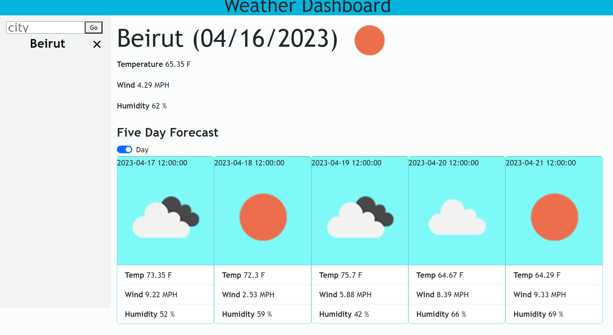

# What is the Weather Like
<h1>Module 6 Project</h1>

<h2>The purpose of this project is to create a weather application that finds the current and five day forecast for the city that the user searched for.</h2>

<h2>Getting Started</h2>

 There is no setup required

<h2>Dependencies</h2>

No dependencies

<h2>Installation</h2>

Download the Zip file, unzip the file, open up the index.html file

<h2>Executing the program</h2>

You can simply run it in your browser

<h2>Author</h2>

Ben Smyth
